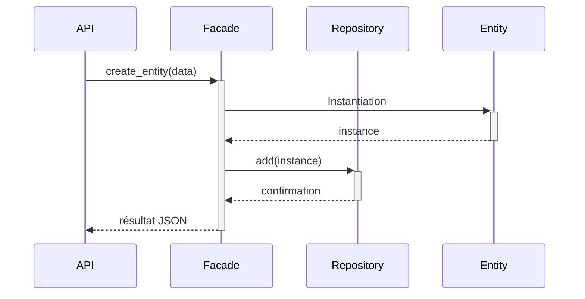

# HBnB – Partie 2 : Implémentation de l'API REST et de la logique métier

## 🎯 Objectif

Cette partie du projet **HBnB** consiste à transformer une conception logicielle en une application complète avec API RESTful, en suivant une architecture modulaire propre. Tu y as implémenté :

1. Une API REST avec Flask et Flask-RESTx
2. Une logique métier modulaire (`User`, `Place`, `Amenity`, `Review`)
3. Un modèle de **façade** pour centraliser les appels métier
4. Un stockage temporaire en mémoire
5. Une validation robuste et des tests fonctionnels

---

## 🗂 Structure du Projet

```mermaid
hbnb/
├── app/
│   ├── api/v1/          # Couche Présentation (endpoints Flask RESTx)
│   ├── models/          # Logique métier : entités
│   ├── services/        # Façade centralisée
│   ├── persistence/     # Référentiel en mémoire
├── run.py              # Point d’entrée de l’app Flask
├── config.py           # Configuration environnement
├── requirements.txt    # Dépendances Python
└── README.md
```

---

## 🧠 Diagramme : Interactions via la Façade



La façade permet une **abstraction centrale** des règles métier et une séparation nette entre les couches.

---

## 📡 Points de terminaison REST

### ✅ Utilisateurs `/api/v1/users/`
| Méthode | Endpoint         | Description                      |
|---------|------------------|----------------------------------|
| POST    | `/`              | Créer un utilisateur             |
| GET     | `/`              | Liste des utilisateurs           |
| GET     | `/<user_id>`     | Détails utilisateur              |
| PUT     | `/<user_id>`     | Mettre à jour un utilisateur     |

### 🏡 Lieux `/api/v1/places/`
| Méthode | Endpoint         | Description                      |
|---------|------------------|----------------------------------|
| POST    | `/`              | Créer un lieu                    |
| GET     | `/`              | Liste des lieux                  |
| GET     | `/<place_id>`    | Détails (propriétaire + extras)  |
| PUT     | `/<place_id>`    | Mettre à jour un lieu            |

### 🛠 Équipements `/api/v1/amenities/`
| Méthode | Endpoint         | Description                      |
|---------|------------------|----------------------------------|
| POST    | `/`              | Créer un équipement              |
| GET     | `/`              | Liste des équipements            |
| GET     | `/<amenity_id>`  | Détail équipement                |
| PUT     | `/<amenity_id>`  | Mettre à jour un équipement      |

### ✍️ Avis `/api/v1/reviews/`
| Méthode | Endpoint                         | Description                          |
|---------|----------------------------------|--------------------------------------|
| POST    | `/`                              | Créer un avis                        |
| GET     | `/`                              | Liste des avis                       |
| GET     | `/<review_id>`                  | Détail avis                          |
| PUT     | `/<review_id>`                  | Mise à jour avis                     |
| DELETE  | `/<review_id>`                  | Supprimer un avis                    |
| GET     | `/places/<place_id>/reviews`    | Avis associés à un lieu              |

---

## ✅ Validation & Gestion des erreurs

Chaque entité applique des règles métier :

- **User** : email unique, prénom/nom requis, format email valide
- **Place** : titre requis, `price` > 0, coordonnées `latitude/longitude` valides
- **Review** : texte obligatoire, `rating` entre 1–5, lien à user/place vérifié

Codes HTTP standards : `200`, `201`, `400`, `404`

---

## 🧪 Tests et documentation

- Swagger UI dispo à : [`/api/v1/`](http://localhost:5000/api/v1/)
- Tests `curl`, Postman et automatisés (`unittest`)
- Cas positifs, erreurs attendues, validations

---

## 🚀 Lancer l’application

```bash
pip install -r requirements.txt
python run.py
```

---

## 📚 Ressources

- [Flask](https://flask.palletsprojects.com/)
- [Flask-RESTx](https://flask-restx.readthedocs.io/)
- [Mermaid](https://mermaid.js.org/)

---